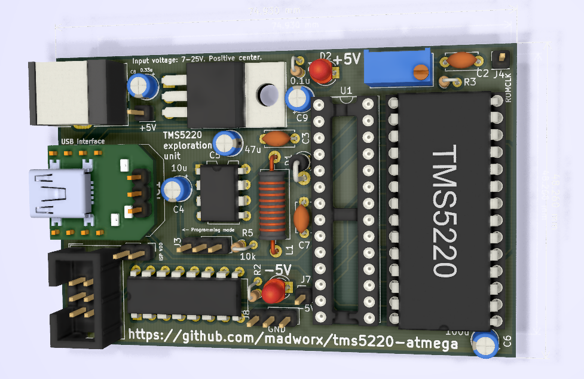
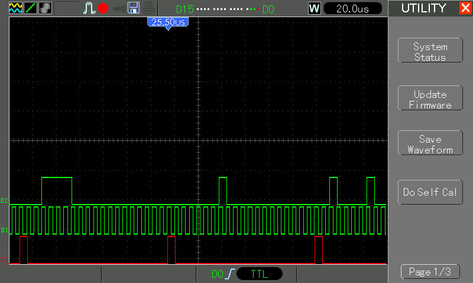
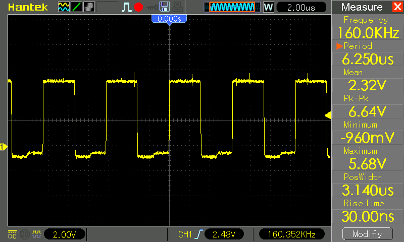
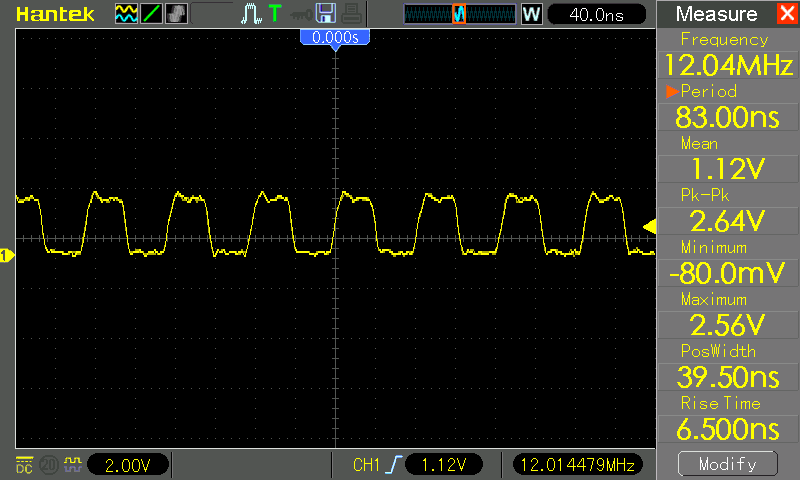
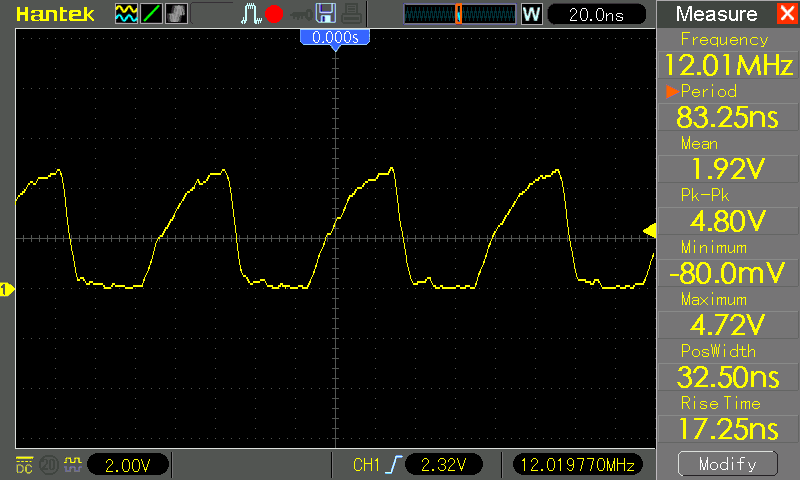

# TMS5220 Exploration unit

This project was created to try out the Texas Instruments TMS5220 _Voice synthesis processor_ (of TI99/4A, Apple II Echo 2, and various pinball/arcade games fame).

First off, a word of warning: The PCB being powered by potentially three sources (PSU, Communication USB, AVR ISP), I've observed some weird behavior with power unexpectedly flowing in the wrong direction, causing intermittent system interruptions, host USB-port lock-up requiring system restart and one burnt MCU.

Preferably disconnect the PSU before connecting the ISP and move the `J3` jumper to programming mode.

The project as it currently is is rather "build your own" but since the project was created to let me toy with the TMS5220 chip, it's not likely to see any major improvements in the forseeable future.



## Software environment

* `avrdude`
* `avr-gcc`

## Peripherials setup

### Programmer (AVR ISP)

I used a cheap `usbasp` clone.

### UB232R

The `UB232R` interface needs to be configured using the [FT_Prog] tool:

* `High Current I/O's` to be disabled.

* Under the `IO Controls` section, output on pin `C0` should be set to `CLK12`, providing the Atmega 328P with a system clock of 12MHz.

The baud rate is the USB interface is configured by the host operating system driver. The MCU UART baud rate need to be matched to this.

[FT_Prog]: https://www.ftdichip.com/Support/Utilities.htm#FT_PROG

### Atmega 328P

* `lfuse` should be programmed to _external clock without /8DIV_ (`0xE0`):

```
avrdude -p m328p -c usbasp -U lfuse:w:0xE0:m
```

## TMS5220 details

### D/A

10-bit twos-complement.

```
|           |  PC latice outputs                                      |            |             |
|-----------|---------------------------------------------------------|------------|-------------|
| Value     |  YD  YC  YB  YA  Y9  Y8  Y7  Y6  Y5  Y4  Y3  Y2  Y1  Y0 | D/A input  | Analog (uA) |
|-----------|---------------------------------------------------------|------------|-------------|
| > +127    |  0   1   1   x   x   x   x   x   x   x   x   x   x   x  |  11111111  |      0      |
| > +127    |  0   1   0   x   x   x   x   x   x   x   x   x   x   x  |  11111111  |      0      |
| > +127    |  0   0   1   x   x   x   x   x   x   x   x   x   x   x  |  11111111  |      0      |
| +127      |  0   0   0   1   1   1   1   1   1   1   1   x   x   x  |  11111111  |      0      |
| +126      |  0   0   0   1   1   1   1   1   1   1   0   x   x   x  |  11111110  |      5.86   |
| etc.      |  0   0   0   .   .   .   .   .   .   .   .   x   x   x  |  ........  |     .....   |
| +1        |  0   0   0   0   0   0   0   0   0   0   1   x   x   x  |  10000001  |    738.00   |
| 0         |  0   0   0   0   0   0   0   0   0   0   0   x   x   x  |  10000000  |    744.00   |
| -1 (off)  |  1   1   1   1   1   1   1   1   1   1   1   x   x   x  |  01111111  |    750.00   |
| -2        |  1   1   1   1   1   1   1   1   1   1   0   x   x   x  |  01111110  |    755.80   |
| etc.      |  1   1   1   .   .   .   .   .   .   .   .   x   x   x  |  ........  |   .......   |
| -128      |  1   1   1   0   0   0   0   0   0   0   0   x   x   x  |  00000000  |   1500.00   |
| < -128    |  1   1   0   x   x   x   x   x   x   x   x   x   x   x  |  00000000  |   1500.00   |
| < -128    |  1   0   1   x   x   x   x   x   x   x   x   x   x   x  |  00000000  |   1500.00   |
| < -128    |  1   0   0   x   x   x   x   x   x   x   x   x   x   x  |  00000000  |   1500.00   |
```


### Timing diagram

* `ROMCLK` = 160kHz (= 6,26uS = 75x 12MHz cycles -> 37.5 cycles per level):
* `T11` is pulled high before the start of each 10-bit word. (Note: The `T11`/`IO` cycle will run as long as the TMS chip is powered, regardless if any `SPEAK` or `SPEAK EXTERNAL` commands are currently running or not.)

```
 | 36| 36| 36| Clock cycles @ 12MHz

                             |
  ___     ___     ___     ___v    ___     ___     ___     ___     ___     ___     ___     ___     ___     
_|   |___|   |___|   |___|   |___|   |___|   |___|   |___|   |___|   |___|   |___|   |___|   |___|   |___|   *ROMCLK*
          _______            :
_________|       |___________:____________________________________________________________________________   *T11*
                          ___:___________________________________________________________________________
_________________________|  lsb  |       |       |       |       |       |       |       |       |  msb  |   *I/O*
                             ^
                             |
                             +-- This is where we sample & store the value of I/O.
```

## Code structure 

* TMS5220 flag us that it's ready to receive data with the use of the `~READY` signal.

* On negative edge trigger: Sample I/O pin, shift storage byte and add bit. (This should be in the range of ~15 instructions)

* On positive edge trigger: Perform state-based logic (max ~35 clock cycles to complete each operation).

* A full write of `DBUS` on the TMS requires us to write to three different ports on the Atmega. (~15 instructions each)


## Accessing the USB UART under linux with 250000 baud rate

```
 $ setserial -a /dev/ttyUSB0 spd_cust
 $ setserial -a /dev/ttyUSB0 divisor 64 # for 375000
 $ setserial -a /dev/ttyUSB0 divisor 96 # for 250000
 $ stty -F /dev/ttyUSB0 38400
 $ socat TCP-L:1147 FILE:/dev/ttyUSB0,b38400,raw,echo=0
```

## Afterthoughts on PCB design

* Atmega reset button on PCB would be nice.
* Proximity to other components makes the jumpers hard to access.
* Should have used a trimmer with lower resistance and a base resistor of higher value to enable more accurate tuning of `ROMCLK`.
* Possibly some form of "mode switch" to select different functions in the MCU.
* Could likely have been powered by USB directly, eliminating the external PSU. (However, need to take into account that +5 and -5V needs to be applied more or less simultaneous)
* Hard to dislodge the TMS chip due to resistor in the way.
* Bottom mounting of TMS resistor on PCB due to placement near socket edge -- has been fixed in current PCB layout, but not in manufactured ones.
* Hard to dislodge Atmega328P due to resistor in the way -- has been fixed in current PCB layout, but not in manufactured ones.
* A status LED or two would be nice.
* Reading more about the TMS chip, I could have driven the "TESTING USE ONLY" `PROMOUT` pin to -5 to enable external clocking, removing timing constraints for the MCU.
* The "programming mode" jumper in the end turned out quite useless -- a proper RESET of the TMS-chip usually cleared up any inconsistencies.
* Multiple pins connected to TMS5220 that in the end weren't needed.
* Power drainage is much higher than expected; Around 500mA and LM7805 reaches 51 degrees C.

## Oscillator caps

### TMS5220 T11, ROMCLK, IO



### TMS5220 ROMCLK output



### UB232R-CLK12



Connected to Atmega328P:



## References

* [TMS5220 Data sheet PDF](references/tms5220.pdf)
* [TMS5220 reference from www.unige.ch](http://www.unige.ch/medecine/nouspikel/ti99/speech.htm)